# evm-source-verification

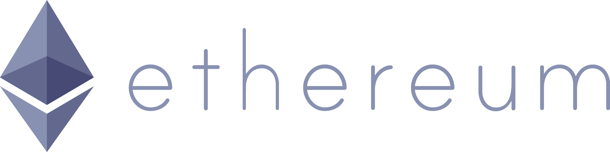

[](https://opensource.org/licenses/MIT)
[](https://github.com/EthVM/evm-source-verification/actions/workflows/build-test.yml)
[](https://snyk.io/test/github/EthVM/evm-source-verification/)

Ethereum smart contract source code verification.

Verifies contract source code and saves the output metadata to `contracts/<chainId>/<contractAddress>`.

With `evm-source-verification` you can:

1. Submit your own smart contracts for verification. See [Submitting a contract](#submitting-a-contract)
2. Verify contracts locally. See [Commands](#commands)
3. View other verified contracts in `contracts/<chainId>/<contractAddress>`

Special thanks to [Sourcify](https://sourcify.dev/) and [Etherscan](https://etherscan.io/).

## Table of Contents

- [Contract files](#contract-files)
  - [input.json](#inputjson)
  - [configs.json](#configsjson)
  - [metadata.json](#metadatajson)
- [Verified Contracts](#verified-contracts)
- [Submitting a contract](#submitting-a-contract)
- [Opening a verified contract in Remix IDE](#opening-a-verified-contract-in-remix-ide)
- [Getting Started](#getting-started)
- [Commands](#commands)
  - [verify](#verify)
    - [Verify mainnet contracts](#verify)
    - [Verify contract in a directory](#verify-contract-in-a-directory)
    - [Verify contracts in many directories](#verify-contracts-in-many-directories)
  - [summarise](#summarise)
  - [pull-contracts](#pull-contracts)
  - [rebuild-tests](#rebuild-tests)

## Contract Files

Contracts require an [`input.json`](#inputjson) and [`configs.json`](#configsjson) file for verification. These specify the source contract's source files and identity.

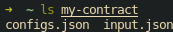

[Contract that are successfully verified](#verified-contracts) (and whose result is saved with `--save`) will have a [`metadata.json`](#metadatajson) file containing the verification output.

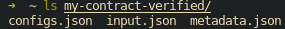

All contracts in `contracts/<chainId>/<contractAddress>` are verified.

You can verify your own contracts using the [`verify`](#verify) command.

### input.json

`input.json` specifies the source files for compiler input for the contract. It includes the source files and compilation options.

For Solidity, `input.json` is the Solidity [`--standard-json` input format](https://docs.soliditylang.org/en/develop/using-the-compiler.html).

For example:

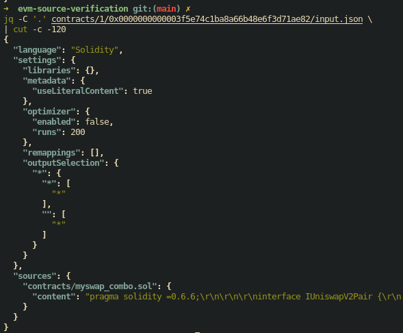

### configs.json

`configs.json` provides the additional information about specifying the contract that isn't required by the compiler.

For example:

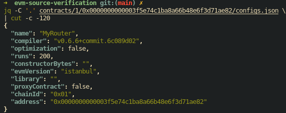

### metadata.json

`metadata.json` provides information on the verified output of the contract. Only contracts that have been verified can have a `metadata.json`.

`metadata.json` contains the contract's ABI, opcode hash, metaless hash, runtime hash, encoded metadata, and more.

For example:

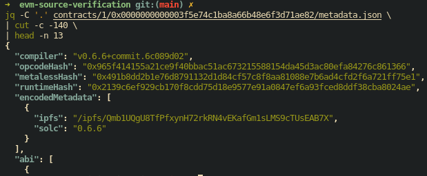

## Verified Contracts

Officially verified contracts are stored under `contracts/<chainId>/<contractAddress>` with their `input.json`, `configs.json` and `metadata.json`.

The `chainId` for mainnet is `1`.

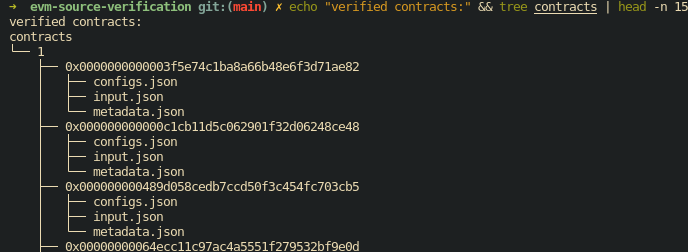

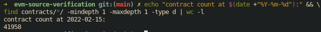

## Submitting a contract

### By Pull Request

You can submit your own contract for verification.

1. [Fork](https://docs.github.com/en/get-started/quickstart/fork-a-repo) the [EthVM/evm-source-verification](https://github.com/EthVM/evm-source-verification) repository.
2. Create a folder `contracts/<chainId>/<contractAddress>/` with:
    1. `configs.json`: a JSON file specifying your contract
    2. `input.json`: the contract's [Solidity --standard-json compiler inpun](https://docs.soliditylang.org/en/develop/using-the-compiler.html).
3. Submit your fork with a [pull request](https://docs.github.com/en/pull-requests/collaborating-with-pull-requests/proposing-changes-to-your-work-with-pull-requests/creating-a-pull-request-from-a-fork) to the [EthVM/evm-source-verification main brach](https://github.com/EthVM/evm-source-verification/tree/main).
    - A Github Action will execute to verify your contract. If successful, your pull request will be closed and a new one will be opened with your contract's verified metadata to be pulled into the main branch.
4. Your contract and will then be merged into the main branch!

### Using EthVM

TODO

## Opening a verified contract in Remix IDE

TODO

## Getting Started

The following steps will enable you to develop `evm-source-verification` or verify your contracts locally.

### Clone the Repository

```sh
# via ssh
git@github.com:EthVM/evm-source-verification.git

# or via https
https://github.com/EthVM/evm-source-verification.git
```

### Set NodeJS and npm versions

Ensure the correct versions of NodeJS and NPM are installed.

We recommend using [Node Version Manager (nvm)](https://github.com/nvm-sh/nvm) to manage your NodeJS versions. You can find the NodeJS version in `./.nvmrc` and npm version in `./package.json#engines#npm`.

3. Install the project's dependencies

```sh
# from within the project's root directory
npm install
```

### Build the project

This will build the project into the `dist` folder

```sh
# from within the project's root directory
npm run build
```

You can now run develop on the project, execute [Commands](#commands), and run tests.

## Commands

`evm-source-verification` exposes cli commands to assist in contract verification.

To execute commands, first download and build the project. For steps, see [Getting Started](#getting-started)

### Verify

The `verify` command takes takes directories with `input.json` and `configs.json` files and compiles and verifies them against the blockchain.

For additional information on the `verify` command, use `node dist/bin.js verify --help`.

```sh
bin.js verify

compile source file and verify the code on evm based chain

Positionals:
  --chainId      Verify contracts of this chainId.                      [string]
  --address      Verify the contract with this address and the given chainId.
                 Requires --chainId.                                    [string]
  --dirs         Verify contracts within the provided directories. Expects a
                 new-line separated string of directories. Reads from stdin if
                 --dirs=-                                               [string]
  --skip         Skip contracts that have already been verified i.e. contracts
                 that have metadata                   [boolean] [default: false]
  --save         Save metadata of successfully verified contracts
                                                      [boolean] [default: false]
  --failFast     Exit on first error                  [boolean] [default: false]
  --jump         Jump past this many contracts before starting to verify[number]
  --concurrency  Number of contracts to verify in parallel. Defaults to the
                 number of CPUs.                          [number] [default: 16]
```


Below are some examples using the `verify` command:

#### Verify mainnet contracts

```sh
node dist/bin.js \
  verify \
  --concurrency=10  `# process at most 10 contracts concurrently` \
  --chainId=1       `# verify contracts from chainId 1` \
  --failFast        `# exit on the first failure`
```

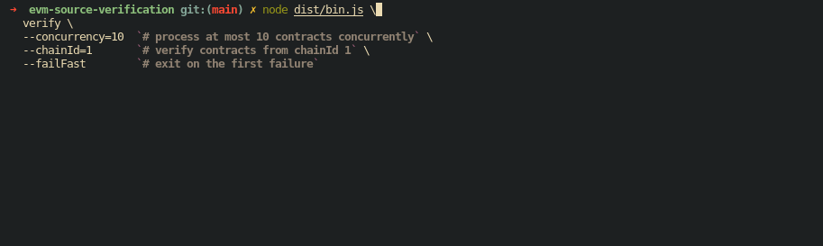


#### Verify contract in a directory

```sh
# verify a single contract
node dist/bin.js \
  verify \
  --dirs=~/my-contract  `# the contract's directory` \
  --save                `# save verified metadata to the contract's directory`
```

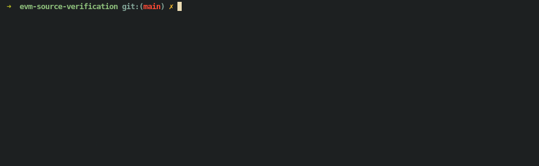

#### Verify contracts in many directories

```sh
# verify contracts from the piped directories
find ~/my-contracts/ -mindepth 1 -maxdepth 1 -type d \
  | head -n 1000        `# first 1000 contracts` \
  | node dist/bin.js \
    verify \
    --concurrency=1     `# process one contract at a time` \
    --dirs=-            `# read directories from stdin`  \
    --save              `# save verified metadata to contract directories`
```


### Summarise

The `summarise` command collects hashes, used compilers, and addresses from all verified addresses and saves them to the `./summary/<chainId>/<output type>`.
- **summary/`<chainId>`/hash.runtime.json**: JSON object whose keys are the runtime hashes of contracts and values are an array of contracts with that runtime hash.
- **summary/`<chainId>`/hash.opcodes.json**: JSON object whose keys are the opcode hashes of contracts and values are an array of contracts with that opcode hash.
- **summary/`<chainId>`/hash.metaless.json**: JSON object whose keys are the metaless hashes of contracts and values are an array of contracts with that metaless hash.
- **summary/`<chainId>`/verified.json**: JSON array of with all the verified addresses.
- **summary/`<chainId>`/compilres.json**: JSON object whose keys are the metaless hashes of contracts and values are arrays of contracts with that metaless hash.

```sh
bin.js summarise

rebuild the summary of all verified contracts
```

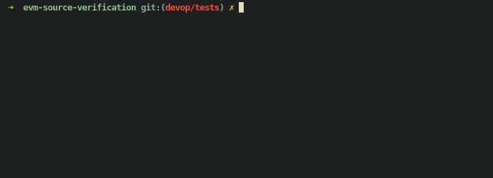

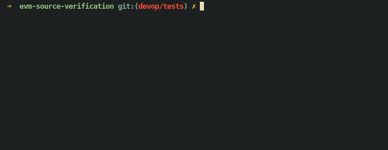

### Pull Contracts

Used by CI to verify contracts added in a pull request [Submitting contracts by pull request](#by-pull-request) for more.

### Rebuild Tests

Cleans and rebuilds contracts used for testing.
